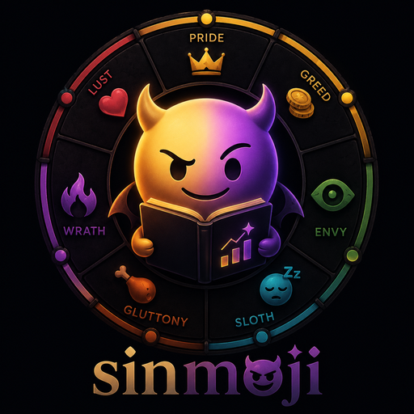

<p align="center">
  
</p>

<h1 align="center">Sinmoji</h1>

<p align="center">
  <strong>让 AI 在回答前，先读懂用户真正想要什么。</strong><br />
  它会捕捉一句话里的情绪、压力、审美和行动偏好，再给出更贴合当下状态的回答风格。
</p>

<p align="center">
  <code>pre-answer analysis</code> · <code>seven localized sins</code> · <code>local profile</code> · <code>style prompt</code>
</p>

---

## 为什么需要 Sinmoji？

用户发来的每句话，都不只是“任务”。它可能同时包含：

<table>
<tr>
<td>想要一个更优雅的架构</td>
<td>想省掉所有麻烦步骤</td>
</tr>
<tr>
<td>想快速止血一个线上问题</td>
<td>想找到更赚钱的路径</td>
</tr>
<tr>
<td>想把竞品反超</td>
<td>想让产品更漂亮、更有吸引力</td>
</tr>
</table>

普通助手通常只看见问题本身。Sinmoji 会多读一层“状态”：用户此刻是烦躁、懒得折腾、追求高级感、想要增长，还是已经被信息量撑爆了。

> Sinmoji 不是为了让 AI 变得夸张，而是让 AI 更会读空气。

当状态被识别出来，回答就能更贴近用户真正想要的东西：该直接时直接，该省事时省事，该商业化时商业化，该拿出审美和标准时就别糊弄。

---

## 七宗罪式的用户状态模型

这里的“七宗罪”不是宗教概念，而是一组面向中文技术、产品、创作者和 AI 工具场景的行为镜头。

| Axis | 状态 | 常见信号 |
|---|---|---|
| `pride` | 高标准与优越感 | 最优解、架构感、专业、优雅、不要低级方案 |
| `envy` | 对比与竞争压力 | 竞品、别人更火、排名、凭什么、差距 |
| `wrath` | 愤怒与故障处置 | 又崩了、太烂了、别废话、赶紧修、生产事故 |
| `sloth` | 省力与自动化 | 懒人包、复制即用、一键、少思考、直接给结果 |
| `greed` | 增长与变现 | ROI、转化、成本、效率、赚钱、规模化 |
| `gluttony` | 过载与更多欲望 | 多给点、完整版本、上下文太多、日志爆炸、资源塞满 |
| `lust` | 审美与吸引力 | 漂亮、丝滑、高级感、好看、想要、体验感 |

每一轴都会被打 `0-5` 分，并累积到本地画像里。随着使用次数增加，Sinmoji 会逐渐知道用户更偏好哪种回答姿态。

---

## 工作流程

```text
User Message
    ↓
Score 7 Axes
    ↓
scripts/sinmoji.py evaluate
    ↓
Update Local Profile + Keyword Matching
    ↓
Optional [SINMOJI_STYLE]
    ↓
Assistant answers with the right tone
```

简化成一句话：先判断用户状态，再更新本地画像，最后把可选风格提示交给助手使用。

风格只影响自然语言表达，不改变事实、代码、命令、JSON、文件名或用户指定格式。

---

## 快速体验

### 评估一条用户消息

```bash
python3 scripts/sinmoji.py evaluate \
  --pride 0 \
  --envy 0 \
  --wrath 5 \
  --sloth 2 \
  --greed 0 \
  --gluttony 0 \
  --lust 0 \
  --question "又崩了，别废话，直接帮我定位问题"
```

如果画像达到触发等级，会输出类似：

```text
[SINMOJI_STYLE]
Primary tone: Wrath / frustration (...)
Available emoji: 💢 🔧
Emoji usage: ...
[/SINMOJI_STYLE]
```

### 查看当前画像 JSON

```bash
python3 scripts/sinmoji.py read
```

### 查看可读的画像报告

```bash
python3 scripts/sinmoji.py report
```

### 重置画像状态

```bash
python3 scripts/sinmoji.py reset
```
